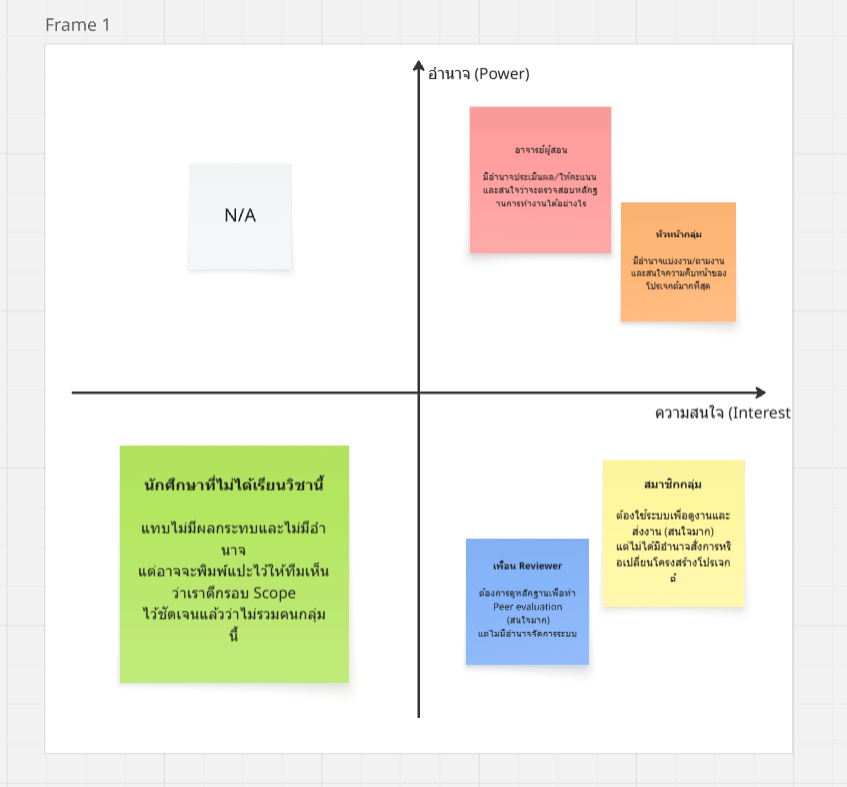

# 02 — Stakeholder, System Context and Scope

> **Week 2 deliverable**  
> เวอร์ชัน: v0.1 | สถานะ: Draft | วันที่ปรับปรุง: [13/07/2569]

## 1. Stakeholder Map

| Stakeholder | Category | Needs / Goals | Influence | Engagement Approach |
|---|---|---|---|---|
| **หัวหน้ากลุ่ม** | Primary user | ต้องการเครื่องมือที่ช่วยแบ่งงานและติดตามความคืบหน้าของสมาชิกแต่ละคนได้ชัดเจน เพื่อลดความยุ่งยากในการตามงาน | สูง | interview / observation |
| **อาจารย์ผู้สอน** | Secondary user | ต้องการมองเห็นภาพรวมการทำงานและหลักฐานการมีส่วนร่วมของนักศึกษาในกลุ่ม เพื่อใช้ประกอบการประเมินคะแนนอย่างเป็นธรรม | สูง | interview |
| **สมาชิกกลุ่ม** | Primary user | ต้องการเห็นหน้าที่รับผิดชอบและกำหนดส่งของตนเองชัดเจน รวมถึงสามารถแนบหลักฐานการทำงานได้ง่าย | กลาง | observation / interview |
| **เพื่อน Reviewer** | Secondary user | ต้องการดูหลักฐานบันทึกการทำงานของเพื่อนในทีม เพื่อนำมาใช้ประเมิน Peer evaluation ได้อย่างตรงไปตรงมา | ต่ำ | review / observation |

## 2. System Context

อธิบายขอบเขตระบบ ความสัมพันธ์กับผู้ใช้/ระบบภายนอก และข้อมูลที่เข้าออก
ส่งเข้าระบบเพิ่ม เพื่อการทำงานกันเป็นระบบและสามารถประเมินตัวเองได้ก่อนส่งงาน

> หากยังไม่มีไฟล์ภาพ ให้สร้าง source diagram และ export ชื่อ `system-context.png`

## 3. Scope Statement

### In Scope

| Area | Included capability | Rationale |
|---|---|---|
| การจัดการภาระงาน | การแสดงบทบาท ความคืบหน้า และสามารถแนบหลักฐาน (ไฟล์, ลิงก์, หรือข้อความ) ได้ | เพื่อให้ทีมเห็นหน้าที่ของแต่ละคน และรวบรวมหลักฐานการทำงานไว้ในที่เดียว ป้องกันข้อมูลกระจัดกระจาย |
| ขอบเขตโครงงาน | รองรับการจัดการงานกลุ่มในระดับ 1 รายวิชา / 1 โครงการ| เพื่อให้ระบบมีขนาดพอเหมาะกับการใช้งานของนักศึกษา ไม่ซับซ้อนจนเกินไป |
| การประเมินผล | มีข้อตกลงและระบบรองรับกระบวนการ Peer evaluation| เพื่อให้มีเกณฑ์การประเมินการมีส่วนร่วมของเพื่อนร่วมทีมที่โปร่งใสและเป็นธรรมตั้งแต่เริ่มต้นโปรเจกต์ |

### Out of Scope

| Area | Excluded capability | Reason |
|---|---|---|
| การสื่อสาร | ไม่รวมระบบ Chat หรือ Video call ไว้ในตัว | ผู้ใช้งานมีแอปพลิเคชันสำหรับการสื่อสารหลักอยู่แล้ว (เช่น Messenger, Discord, Line) การสร้างเพิ่มจะซ้ำซ้อนและเกินความจำเป็น |
| การเชื่อมต่อระบบ | ไม่เชื่อมต่อกับระบบคะแนนมหาวิทยาลัย หรือระบบจัดการรายวิชาทั้งมหาวิทยาลัย | เกินขอบเขตของโปรเจกต์รายวิชานี้ และลดความเสี่ยงด้านความปลอดภัยของข้อมูลส่วนบุคคล |
| การบริหารระดับสูง | ไม่ทำเป็นระบบบริหารโครงการระดับองค์กร หรือระบบ HR/timesheet จริง | กลุ่มเป้าหมายคือนักศึกษาที่ทำงานกลุ่ม ไม่ใช่พนักงานบริษัท ระบบจึงควรเน้นความเรียบง่ายและยืดหยุ่น |

## 4. Constraints and Business Rules

| ID | Constraint / Rule | Source | Impact |
|---|---|---|---|
| C-01 | ในการติดตามระบบ บทบาทสามารถเปลี่ยนได้ตามความเหมาะสม |  | [กรอก] |
| C-02 | ระบบไม่ได้เชื่อมต่อกับการให้คะแนนของอาจารย์เป็นเพียงแค่การติดตามผล | Case Card / evidence | [กรอก] |
| C-03 | การเปลี่ยนสถานะงานเป็นเสร็จสิ้น จะต้องมีการแนบหลักฐานเช่น ไฟล์, ลิงก์, ข้อความ เสมอ|---|---|
| R-01 | ผู้ใช้จะต้องมีอุปกรณ์ที่เชื่อมต่อระบบเครื่องข่ายได้ |  | [กรอก] |

## 5. Ethics, Privacy and Accessibility Considerations

- ข้อมูลส่วนบุคคลที่ระบบอาจเกี่ยวข้อง: [กรอก]
- ความเสี่ยงด้านสิทธิ์การเข้าถึง/ความปลอดภัย: [กรอก]
- การเข้าถึงสำหรับผู้ใช้หลากหลายกลุ่ม: [กรอก]
- ข้อควรระวังด้านจริยธรรม: [กรอก]

## 6. Baseline Scope Decision

สรุปสิ่งที่ทีมตกลงใช้เป็น baseline หลัง Week 2 และอ้างอิง decision log

[กรอก]
